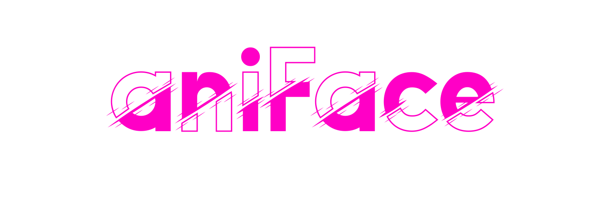
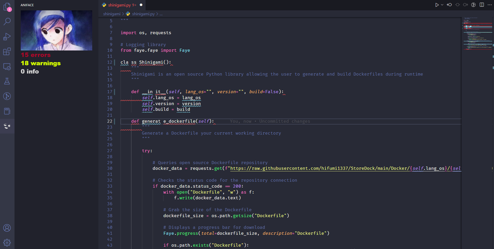

<h1 align="center">
    
</h1>

aniFace is a simple VS Code extension created to be a cute visualization for tracking errors, warnings, and informational diagnostics while coding.

You can install this extension under the VS code Extensions tab by searching "aniface" or by visiting my [publisher page](https://marketplace.visualstudio.com/publishers/azazelm3dj3d).

## Example

 

Huge shoutout to the individual who inspired this concept: [virejdasani](https://github.com/virejdasani).

[virejdasani](https://github.com/virejdasani) created [InYourFace](https://github.com/virejdasani/InYourFace), which used the original Doom "ouch" expressions while tracking errors.
